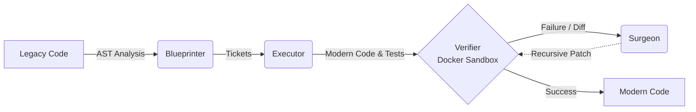

# 🚀 ZeroClaw Migration Pipeline


An industrial-grade, multi-agent AI pipeline built in Rust to automatically migrate legacy codebases (Node.js, Python, etc.) to modern stacks using a non-linear feedback loop.

## 🏗 Architecture & Non-Linear Feedback Loop



The pipeline utilizes a non-linear feedback loop with four specialized agents:

1. **Blueprinter:** Analyzes the legacy codebase Abstract Syntax Tree (AST) and plans independent migration tickets.
2. **Executor:** Translates legacy code blocks into the modern target stack and generates matching tests.
3. **Verifier:** Generates shadow-test fixtures from the legacy AST, executes both legacy and modern code in isolated Docker containers, and guarantees semantic equivalence by rejecting any behavioral divergence.
4. **Surgeon:** Recursively patches failing code based on execution diffs from the Verifier until the tests pass.

## ✨ Key Features

- **Multi-Provider Routing:** Leverage the best LLMs for specific tasks using ZeroClaw (e.g., OpenAI, Together.ai, OpenRouter).
- **Docker Sandbox Isolation:** Verification runs in short-lived Docker containers with `--network=none` for secure shadow testing, strict CPU/memory limits, and a read-only `modern_app` mount.
- **AST-Aware Diffing:** Uses Tree-sitter to perform semantic analysis and generate precise execution diffs, bypassing brittle string matching.
- **Resilient State Management:** Migration state (Tickets) is atomically checkpointed to an SQLite database (`.migration_state.db`), allowing the pipeline to pause and resume seamlessly.
- **Interactive TUI:** A beautiful terminal interface powered by `inquire` to configure and track migration progress.

## 🛠 Prerequisites

- **Rust:** Edition 2024, version 1.87 or higher.
- **Docker:** A running Docker Daemon for isolated shadow testing.
- **API Keys:** An active API key for your chosen LLM provider(s) (e.g., OpenRouter, OpenAI, Together.ai).

## 🚀 Installation & Getting Started

1. **Clone the repository:**
   ```bash
   git clone https://github.com/your-org/migration_pipeline.git
   cd migration_pipeline
   ```

2. **Build the pipeline:**
   ```bash
   cargo build --release
   ```

## ⚙️ Configuration

Create a `.env` file in the root directory to configure multi-provider routing. This allows you to route different agents to the most capable (or cost-effective) models.

```env
# .env.example
OPENROUTER_API_KEY=your_openrouter_api_key_here

# Route the Blueprinter to a reasoning model
BLUEPRINTER_MODEL=google/gemini-3-flash-preview

# Route the Executor to a coding specialist
EXECUTOR_MODEL=together_ai/meta-llama/Llama-3-70b-chat-hf

# Verifier and Surgeon can also be independently routed
VERIFIER_MODEL=z-ai/glm-5
SURGEON_MODEL=anthropic/claude-3.5-sonnet

# Maximum concurrent tickets
MAX_CONCURRENT_TICKETS=3
```

## 💻 Usage

Launch the interactive terminal interface:

```bash
cargo run --release
```

The TUI (powered by `inquire`) will guide you through:
1. **Starting a Migration:** Setting the source directory of the legacy codebase and the destination directory for the modernized output.
2. **Configuration:** Adjusting pipeline settings and confirming the target framework (e.g., "TypeScript on Node.js LTS").
3. **Execution:** The pipeline will orchestrate the agents, write to `.migration_state.db`, and stream progress to the console.

## 🧠 AI/Agent Context (Repository Manifest)

> **Note to AI Coding Assistants:** Use this manifest to quickly navigate the project structure.

- `src/agents/`: Contains the core logic and traits for the 4 LLM actors (`Blueprinter`, `Executor`, `Verifier`, `Surgeon`).
- `src/skills/`: Implementations of deterministic tools provided to the agents, including Docker integration (`SandboxSkill`, `ShadowTestSkill`), AST parsing (`ASTParsingSkill`), and File I/O.
- `src/config/`: Configuration loading, `.env` parsing, and ZeroClaw multi-provider model routing.
- `src/pipeline/`: Core orchestration of the non-linear feedback loop.
- `src/utils/`: Telemetry, logging, and SQLite state management (`state.rs`).
- `src/cli.rs`: The interactive Terminal User Interface (TUI) powered by `inquire`.
- `src/main.rs`: The entry point that ties the configuration, CLI, and pipeline orchestration together.
- `.migration_state.db`: The SQLite database used for durable state checkpointing.
